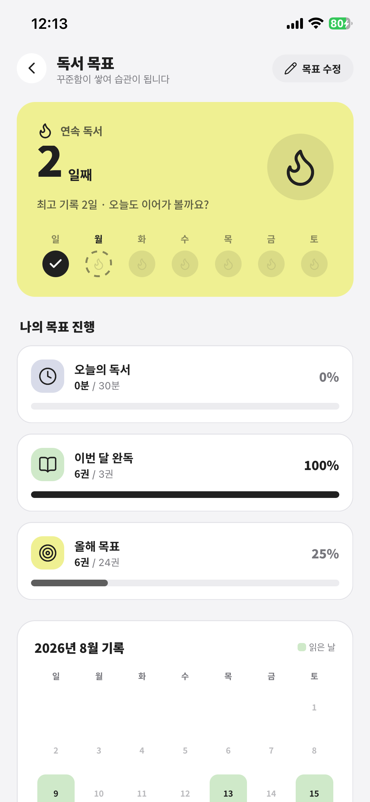

# 갈피 (Galpi)

책 속 문장을 기록하고 독서 습관을 관리하는 Expo(React Native) 앱입니다.

## 주요 기능

- 책 문장 기록 및 편집, 즐겨찾기, 컬렉션 관리
- 카메라 OCR로 문장 스캔해서 바로 등록
- 알라딘 API 연동 책 검색/조회
- 독서 타이머, 독서 목표, 뱃지 등 독서 습관 트래킹
- 통계 리포트(요일/시간대, 장르별 독서 패턴)
- Firebase 기반 계정(이메일/소셜 로그인 연동) 및 데이터 백업
- 다크모드(시스템/라이트/다크) 지원

## 스크린샷

| 내 서재 | 상세 | 독서 집중 뽀모도로 |
| :---: | :---: | :---: |
|  |  |  |

| 독서 알림 | 독서 리포트 | 독서 목표 |
| :---: | :---: | :---: |
|  |  |  |

## 기술 스택

- [Expo](https://expo.dev) / React Native / Expo Router
- TypeScript
- NativeWind (Tailwind CSS for RN)
- Zustand (상태 관리)
- Firebase (Auth / Firestore / Storage)
- Vercel Functions (API 라우트: `api/`)

## 프로젝트 구조

```
app/            Expo Router 화면 라우트
components/     화면(screens), 레이아웃, 공용(galpi) 컴포넌트
lib/            훅, 데이터 레이어
api/            Vercel 서버리스 함수 (알라딘 검색/조회, OCR)
assets/         아이콘, 폰트 등 정적 리소스
```

## 시작하기

```bash
npm install
```

### 환경 변수

`.env` / `.env.local`에 아래 값을 채워주세요.

```
# Firebase
EXPO_PUBLIC_FIREBASE_API_KEY=
EXPO_PUBLIC_FIREBASE_AUTH_DOMAIN=
EXPO_PUBLIC_FIREBASE_PROJECT_ID=
EXPO_PUBLIC_FIREBASE_STORAGE_BUCKET=
EXPO_PUBLIC_FIREBASE_MESSAGING_SENDER_ID=
EXPO_PUBLIC_FIREBASE_APP_ID=
EXPO_PUBLIC_FIREBASE_MEASUREMENT_ID=
EXPO_PUBLIC_GOOGLE_WEB_CLIENT_ID=

# 알라딘 도서 API
ALADIN_TTB_KEY=
EXPO_PUBLIC_ALADIN_API_BASE=
```

### 실행

```bash
npm run start    # Expo 개발 서버
npm run ios      # iOS 시뮬레이터
npm run android  # Android 에뮬레이터
npm run web       # 웹
```

### 웹 빌드

```bash
npm run build
```

## Firebase

`firebase.json`, `firestore.rules`, `storage.rules`로 Firestore/Storage 보안 규칙을 관리합니다.
